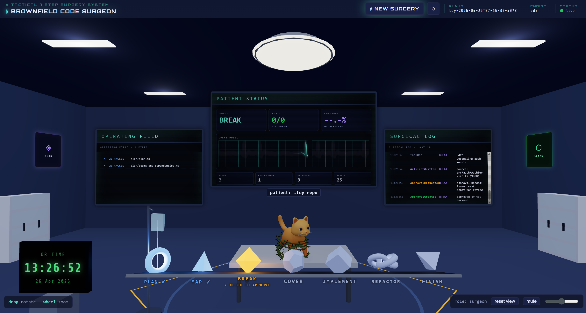

# Brownfield Code Surgeon

A package of tools that productionize the **seven-agent brownfield code-surgery workflow** — Plan, Map, Break, Cover, Implement, Refactor, Finish — from:

> Ganesan, Vivek, Kamal Raj Sekar, and Kiran Kashyap. '*Agentic Code Surgery for Brownfield Systems*'. Zenodo, 18 April 2026. https://doi.org/10.5281/zenodo.19640171 

Author of this package is the original author of the paper mentioned above.

## Screenshot



## Motivation

AI coding assistants are more helpful in greenfield development than for modifying brownfield code — large, undertested, poorly-maintained systems that make up the majority of professional programming.

This package aims to change that.  This package `brownfield-code-surgeon` will enable easily working with brownfield repositories using Claude code.

## One backbone, three user interface choices

All interfaces read and write the same artifacts and emit the same events.

| User Interface | Package | Purpose | Usage Guide |
|---|---|---|---|
| Claude Code plugin | `packages/plugin` | Native subagents + slash commands + forbidden-moves hooks.  | Refer the plugin's [README.md](packages/plugin/README.md) |
| CLI based SDK runner (with optional Claude managed runner for final phase) | `packages/sdk-runner` | Local Node CLI driving the pipeline via the Claude Agent SDK.  Optionally hands-off the final phase to Claude managed runners | Refer the runner's [README.md](packages/sdk-runner/README.md) |
| Operating-theater web UI | `packages/ui` | Vitals, seams graph, phase timeline, approval controls | Refer the UI's [README.md](packages/ui/README.md) |

Shared contracts live in `packages/shared`; the source-of-truth agent prompts live in `packages/core-prompts`.

## Setup

### Environment Variables (Needed only if you use Claude Managed Runners)

Copy `.env.example` to `.env.local` and configure your credentials:

```bash
cp .env.example .env.local
```

Then edit `.env.local` with your API keys:

```env
# Required: Anthropic API key
SURGERY_ANTHROPIC_API_KEY=sk-your-key-here

# Optional: GitHub token (can also be configured via UI)
SURGERY_GIT_TOKEN=ghp_...

# Optional: Managed-Agents environment ID (can also be configured via UI)
ANTHROPIC_AGENT_ENV_ID=env_...
```

The `.env.local` file is git-ignored and will not be committed.

## License

MIT. See [LICENSE](./LICENSE).
